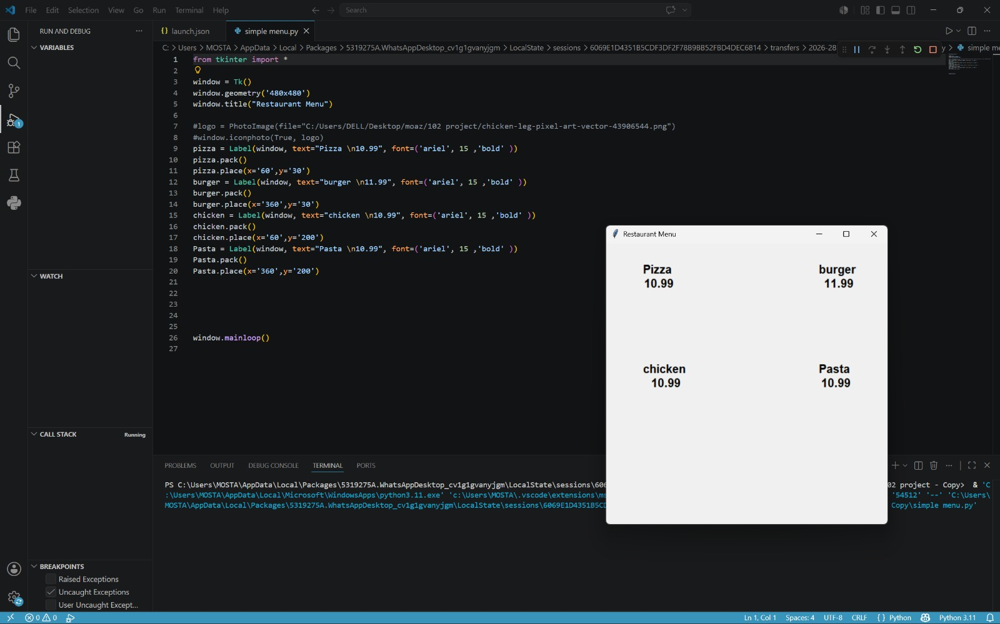

# 🍽️ Restaurant Menu GUI

A simple desktop application built with **Python** and **Tkinter** that displays a restaurant menu through a graphical user interface (GUI).

---

## 📖 Overview

Restaurant Menu GUI is a beginner-friendly desktop application developed using **Python** and **Tkinter**. The project demonstrates the basics of GUI development, widget organization, and simple desktop application design. It provides an interactive restaurant menu with a clean and easy-to-use interface.

---

## ✨ Features

- Graphical User Interface (GUI)
- Built with Python and Tkinter
- Displays restaurant menu items and prices
- Simple and user-friendly design
- Easy to customize and expand
- Beginner-friendly project

---

## 🛠 Technologies Used

- Python 3
- Tkinter

---

## 📂 Project Structure

```text
restaurant-menu-gui/
│── simple menu.py
│── simpel menu v3.py
│── download.png
│── 0000.png
│── screenshot.png.jpeg
└── README.md
```

---

## 🚀 Installation

Clone the repository:

```bash
git clone https://github.com/marwanhazem127-lab/restaurant-menu-gui.git
```

Run the application:

```bash
python "simple menu.py"
```

or

```bash
python "simpel menu v3.py"
```

---

## 📸 Screenshot



---

## 👨‍💻 Authors

- **Marwan Hazem**
  GitHub: https://github.com/marwanhazem127-lab

- **Mostafa Hashem Zayed**
  GitHub: https://github.com/mostafa-hashem-zayed

---

## 📄 License

This project was created for educational purposes.
